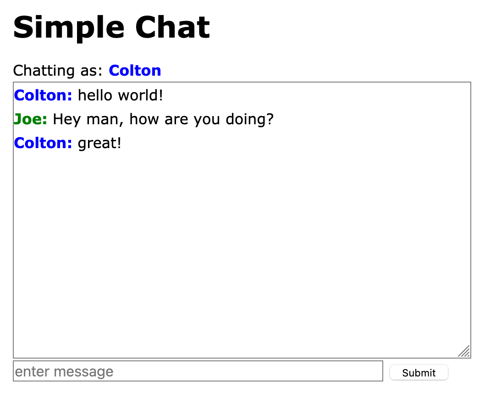
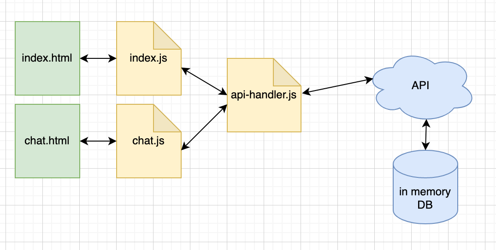

# simple-chat-web

## Intro

Welcome to Simple Chat! This is an educational web chat project. It's built *only* with HTML, CSS, and vanilla JavaScript.

It uses the [simple-chat-api](https://github.com/coltonhurst/simple-chat-api).

This is not designed for performance, nor for production usage. It's a fun, educational project showcasing a web chat that validates usernames and sends messages to only one "chat room", using bare bones web technologies with a REST API.

## Try it out

To try it out, download the repository and serve the code via a web server. This could be with [nginx](https://nginx.org/en), [apache](https://httpd.apache.org/), or if you already have [Node](https://nodejs.org/en/) installed, the [http-server](https://www.npmjs.com/package/http-server) is a great npm package for local development.

Here's what it looks like in action:

## Architecture

There are only two pages, `index.html` and `chat.html`. The first is where you "register" a username, the second where you chat. Each page has a corresponding JS file with the same name, and each talks with the API via the `api-handler` abstraction.

Here is a simple diagram explaining the architecture:

